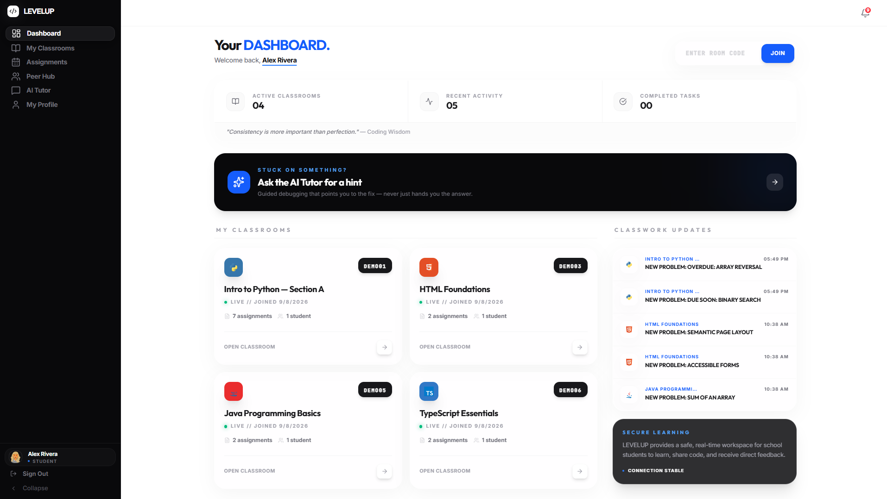
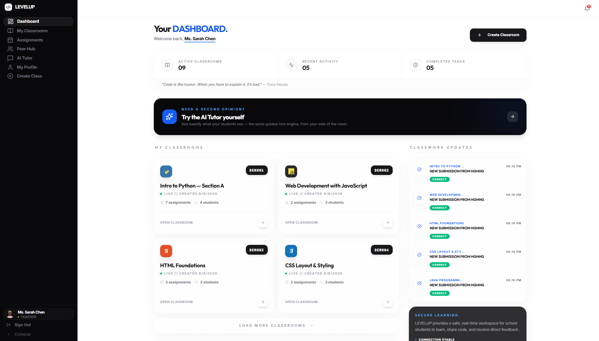
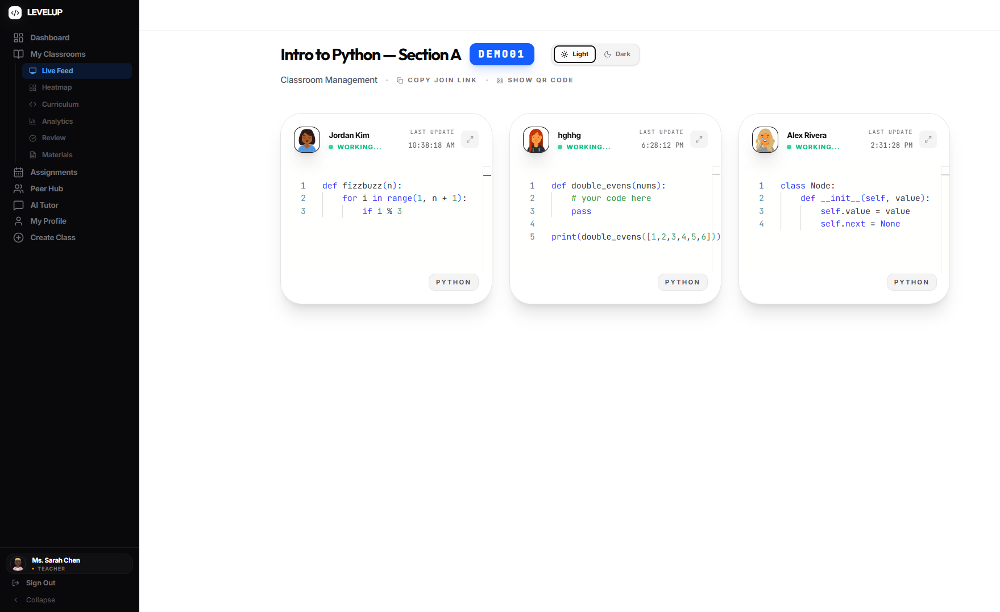
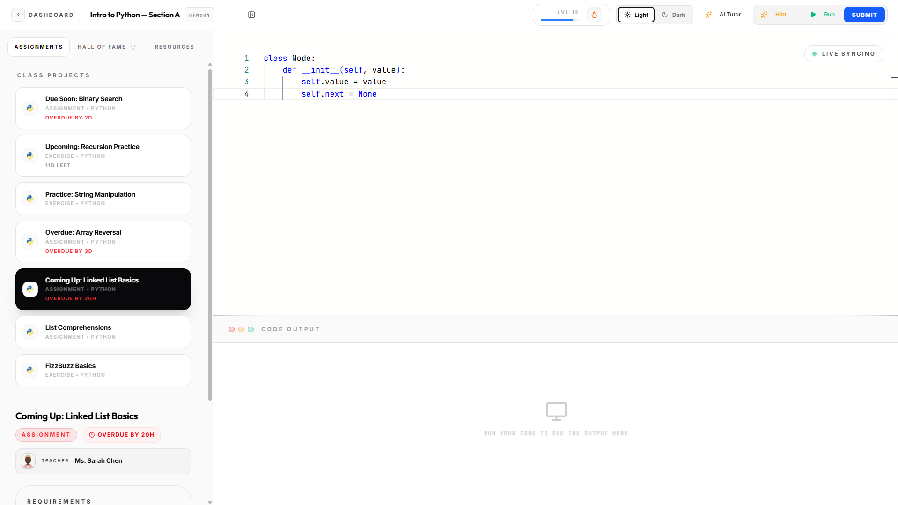
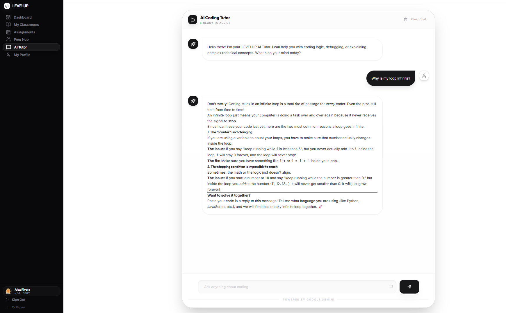
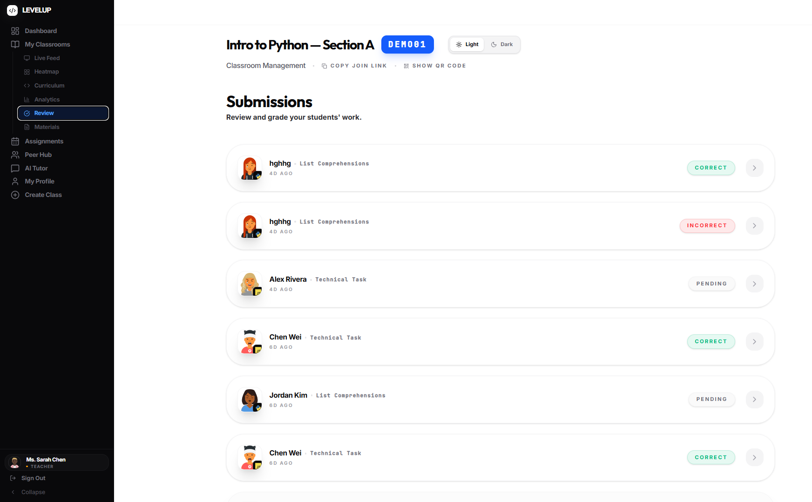
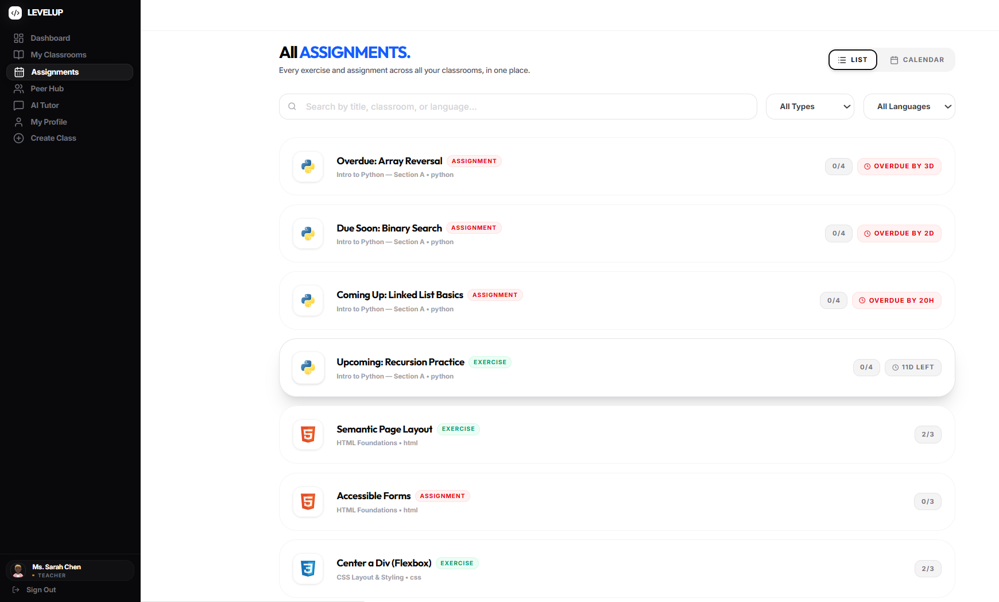
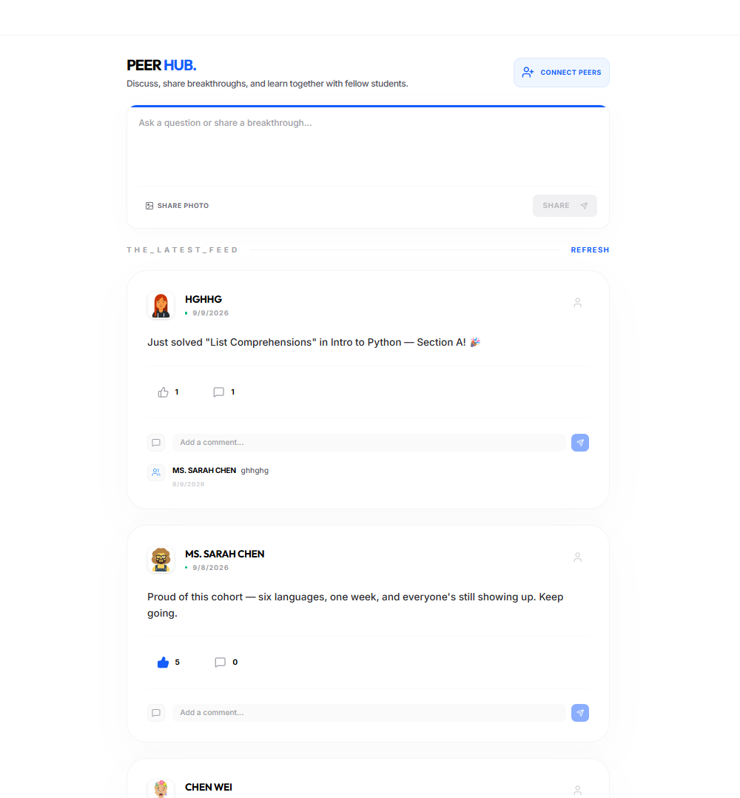
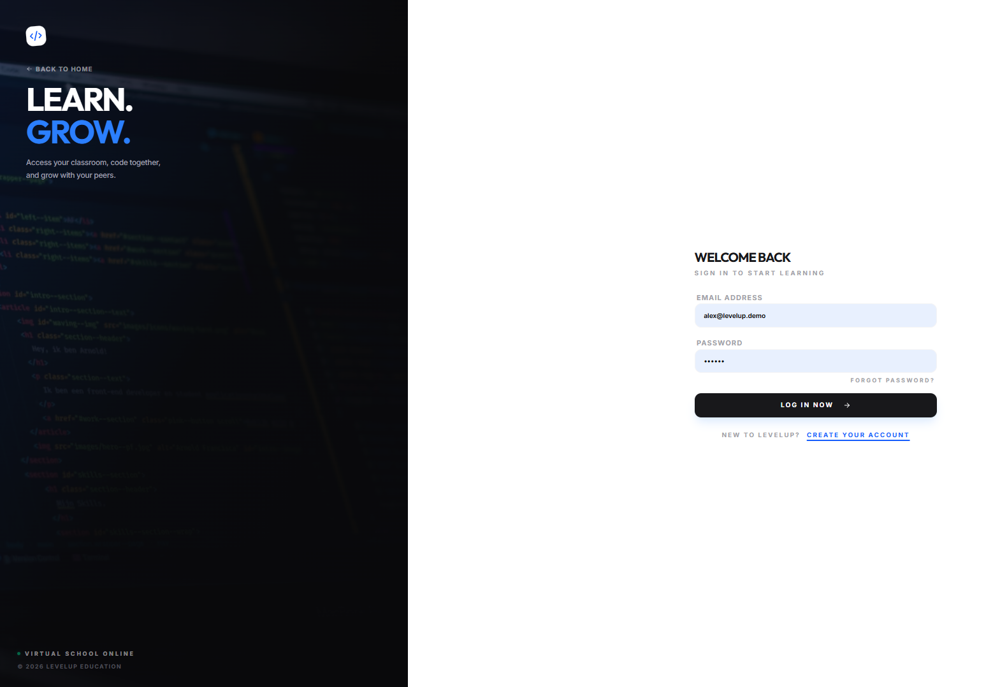
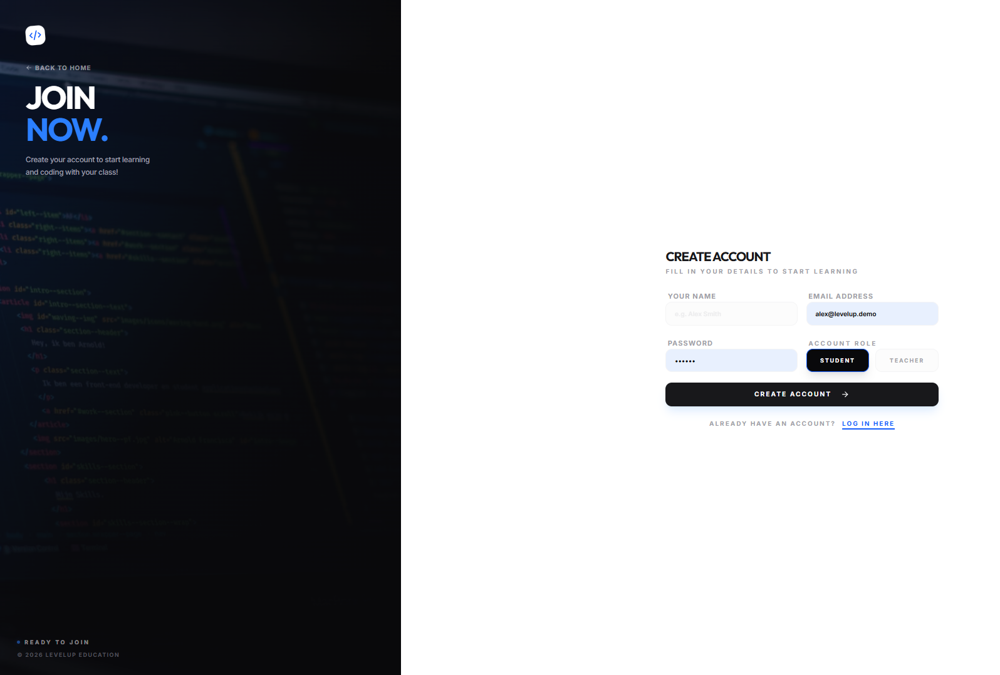

# LEVELUP | The Real-Time, AI-Guided Coding Classroom 🚀


**LEVELUP** is a real-time, AI-guided coding classroom that closes the feedback gap in programming education — from days down to seconds — by giving every institution, regardless of budget, near one-on-one mentorship quality.

---

## 📑 Table of Contents

- [The Problem](#-the-problem-fragmented-learning)
- [The Solution](#-the-solution-a-unified-real-time-workspace)
- [How It Works](#-how-it-works)
- [Features](#-features)
- [Screenshots](#-screenshots)
- [Technical Architecture & Stack](#-technical-architecture--stack)
- [Getting Started](#-getting-started)
- [Security Model](#-security-model)
- [Keeping the Database Alive](#-keeping-the-database-alive-supabase-free-tier)
- [Key Design Decisions](#-key-design-decisions)

---

## 🔴 The Problem: Fragmented Learning

Traditional coding education suffers from **cognitive load overload**. Students typically juggle four or more disconnected tools at once:

| Tool | Problem |
|---|---|
| Screen share (Zoom/Meet) | Laggy, low resolution, one-directional |
| Local IDE (VS Code/IntelliJ) | Configured differently for every student, invisible to the teacher |
| Documentation | Scattered across endless browser tabs |
| Chat (Discord/Slack/Email) | Feedback is delayed, often by days |

This context-switching friction destroys the learner's flow state, and delays the one thing that actually prevents a struggling student from disengaging: **immediate, tactical feedback**.

## 🟢 The Solution: A Unified Real-Time Workspace

LEVELUP consolidates live demonstration, structured assignments, a synchronized code editor, an AI teaching assistant, and instructor feedback into **one single-source-of-truth workspace** — eliminating tool-switching friction and cutting the feedback loop from days to seconds.

## ⚙️ How It Works

### Student Flow
1. **Join** a classroom instantly with a teacher-provided room code — no local setup required.
2. **Code** in a live-synced, in-browser editor (Monaco — the engine behind VS Code).
3. **Get unstuck** by asking the AI tutor, which reads the actual assignment and your current code to give a logic hint — never the full answer.
4. **Submit** the assignment directly from the classroom.
5. **Get feedback** the moment the teacher reviews it — pushed instantly, not on next login.

### Teacher Flow
1. **Create** a classroom and post assignments with starter code, sample input/output, and difficulty level.
2. **Watch** every enrolled student's code update live on a single roster dashboard — no need to walk around a physical room or wait for a submission.
3. **Intervene** the moment a student stalls, instead of finding out days later during grading.
4. **Grade** submissions inline and trigger an instant notification back to the student.

## ⚡ Features

| Feature | What It Does | Problem It Solves |
|---|---|---|
| **Real-Time Synced Classroom** | Monaco-based editor streams a student's code to their teacher via WebSocket subscriptions, throttled to avoid overloading the database | Eliminates the blind spot between what a student writes and what a teacher can see |
| **AI-Powered Guided Discovery Tutor** | Reads the specific assignment + live code buffer, then generates a hint that points at the logical flaw — never the solution | Instant, always-available first-line debugging help without giving away answers |
| **Live Teacher Roster & Feedback** | Every student's live status (idle / working / submitted) on one dashboard, with inline grading | Cuts the feedback loop from days to seconds |
| **Peer Learning Hub** | Opt-in social layer — students share progress, follow peers, comment | Sustains engagement and accountability between sessions |
| **Multi-Channel Notifications** | Real-time push notifications for grading, follows, likes, comments | No need to check five different apps to know what happened |
| **Row Level Security on Every Table** | Postgres RLS scopes every table so a student can only see their own live code, and only their own teacher can see it | Live student code and feedback data are never exposed to the wrong user |
| **Deadline Awareness, Search & Calendar** | Optional due dates on assignments with a self-updating countdown badge, plus a cross-classroom page to search every assignment or view them on a month calendar | Removes the need to check every classroom individually to find what's due and when |
| **Assignment Analytics** | Per-assignment breakdown of not-started/in-progress/submitted students, average time-to-submit, and which assignment generates the most AI-tutor hint requests | Surfaces which students are stuck and which concepts need re-teaching, without manual tracking |

## 📸 Screenshots

| | |
|---|---|
| **Student Dashboard** <br>  | **Teacher Dashboard** <br>  |
| **Live-Synced Classroom (Teacher View)** <br>  | **Student Classroom Editor** <br>  |
| **AI Guided-Discovery Tutor** <br>  | **Submissions Review (Teacher)** <br>  |
| **Cross-Classroom Assignments & Calendar** <br>  | **Peer Hub** <br>  |
| **Login** <br>  | **Register** <br>  |

## 🛠 Technical Architecture & Stack

| Layer | Technology | Purpose |
| :--- | :--- | :--- |
| **Frontend** | React 18 + TypeScript | UI management with strict type safety for complex entities |
| **Styling** | Tailwind CSS v4 | Utility-first styling for a "technical" and consistent aesthetic |
| **Backend** | Supabase (PostgreSQL) | Auth, database, and real-time row-level subscriptions |
| **Real-Time** | Supabase Realtime | Instant synchronization of code, notifications, and social activity |
| **AI Engine** | Google Gemini API | Logic-based tutoring and hints, called via a server-side proxy |
| **Code Editor** | Monaco Editor | The same editor engine that powers VS Code |
| **Motion** | Framer Motion | Fluid route transitions and layout animations |
| **Icons** | Lucide React | Professional, high-density iconography |

---

## 🚀 Getting Started

### Prerequisites
*   Node.js 18 or later
*   A free [Supabase](https://supabase.com) account and project
*   A [Google Gemini API key](https://ai.google.dev/)

### Installation
```bash
git clone <this-repository-url>
cd levelup
npm install
```

### Configuration
1. Copy the example environment file: `cp .env.example .env`
2. In your Supabase project dashboard, go to **Settings → API** and copy your Project URL and anon/public key into `VITE_SUPABASE_URL` and `VITE_SUPABASE_ANON_KEY`.
3. Add your Gemini API key to `GEMINI_API_KEY` and `VITE_GEMINI_API_KEY`.
4. In the Supabase SQL Editor, run the full contents of `supabase_schema.sql` to create all tables, RLS policies, and triggers.
   - **Already have an existing LEVELUP database?** Run `supabase_migration_duedate.sql` and `supabase_migration_analytics.sql` instead — they add the due-date and analytics features to an existing schema without touching your data.

### Running Locally
```bash
npm run dev
```
The app will be available at `http://localhost:5173`.

### Building for Production
```bash
npm run build
npm run start
```

---

## 🔒 Security Model

All tables use Postgres Row Level Security (RLS). Notably:

*   **No open write policies.** Actions with side effects on other users' data (liking a post, notifying a user) go through `SECURITY DEFINER` RPC functions or database triggers (`increment_post_likes`, `notify_on_post_like`, `notify_on_comment`, `notify_on_follow`) rather than permissive `USING (true)` policies, so a client can only ever mutate exactly what the function allows — not arbitrary columns or rows.
*   **Live session isolation.** `live_sessions` (a student's real-time code buffer) is only readable by the student who owns it or the teacher of that specific classroom — not by any other authenticated user.
*   **Scoped notifications.** Notifications can only be inserted by a party with a real teacher↔student relationship in a shared classroom (or automatically via trigger for social actions), preventing notification spoofing/spam.

## ⏱ Keeping the Database Alive (Supabase Free Tier)

Supabase's free tier pauses a project after 7 days with no database activity. This repo includes `.github/workflows/keep-alive.yml`, a scheduled GitHub Action that pings the Supabase REST API twice a week to reset the inactivity timer — no paid plan required. To enable it, add these two repository secrets under **Settings → Secrets and variables → Actions**:

*   `SUPABASE_URL`
*   `SUPABASE_ANON_KEY`

## 🎓 Key Design Decisions

**Why WebSocket subscriptions instead of polling?** Supabase Realtime uses WebSockets, so the server pushes only relevant delta changes to the specific user's channel instead of the client repeatedly checking for updates. A student with 100+ notifications only receives the one they need, keeping bandwidth and memory usage low as the number of concurrent users grows.

**Why Framer Motion for Focus Mode?** CSS transitions alone don't account for the final geometry of child elements, which causes layout "snapping." Framer Motion's `layout` prop uses the FLIP (First, Last, Invert, Play) technique to calculate the delta and apply hardware-accelerated transforms, giving a smooth 60fps expansion of the code editor.

**How is the AI tutor's "no direct answers" behavior enforced?** Via explicit system instruction to the Gemini model: it is told to identify the logical flaw in the student's code and guide them toward the fix without ever supplying the corrected code block. This is a deliberate constraint, not an incidental behavior — most AI coding assistants optimize for producing correct code fast, which is the wrong incentive for learning.

---

Developed to help students learn faster with immediate, always-available feedback.
