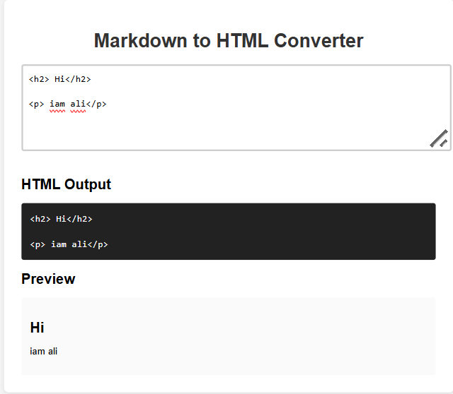

# Markdown to HTML Converter

This project is a simple Markdown to HTML Converter built with vanilla JavaScript, HTML, and CSS. It allows you to write Markdown in a textarea and instantly see both the raw HTML output and a live preview.



## Features
- Converts Markdown headings (#, ##, ###) to HTML headings (h1, h2, h3)
- Supports bold (**text** or __text__), italic (*text* or _text_), links, images, and blockquotes
- Handles nested formatting (e.g., bold inside blockquotes, italic inside bold)
- Live HTML output and preview as you type
- Clean, modern UI

## Usage
1. Open `index.html` in your browser.
2. Type Markdown into the textarea.
3. View the HTML output and live preview below.

## Folder Structure
```
Markdown to HTML Converter/
├── index.html
├── script.js
├── style.css
├── README.md
├── page.png
```

## Example Markdown
```
# Heading 1
## Heading 2
### Heading 3
**bold text**
*italic text*
[link](https://example.com)

> blockquote
```

## License
MIT
