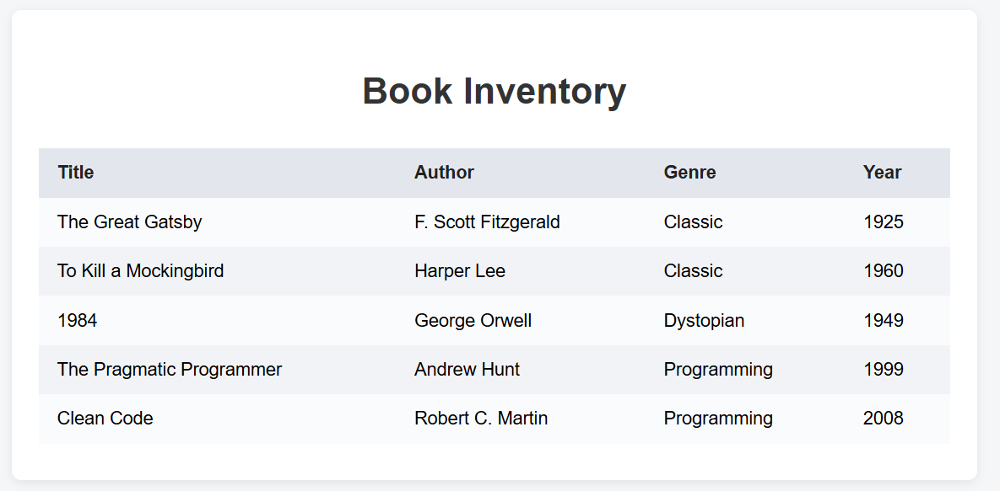

# Book Inventory App

This project is a simple Book Inventory App built with HTML, CSS, and JavaScript. It displays a list of books in a clean, organized table format. The app demonstrates how to present structured data and maintain visual consistency for repeated elements.

## Features
- Displays a list of books with Title, Author, Genre, and Year
- Clean, modern table layout
- Responsive and visually appealing design

## How to Use
1. Open `index.html` in your web browser.
2. The table will display a sample list of books.

## Preview

## Files
- `index.html` — Main HTML file
- `styles.css` — CSS for styling
- `script.js` — JavaScript for dynamic content
- `page.png` — Screenshot preview of the app

## Customization
You can add, remove, or edit books in the `books` array in `script.js`.

---
This project is great for learning how to display and style structured data for dashboards, product listings, or management systems.
