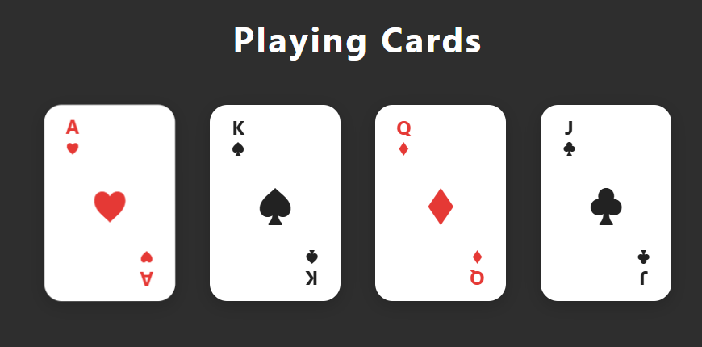

# Playing Cards CSS Project

This project visually demonstrates how to create playing cards using only HTML and CSS. It focuses on layout, spacing, alignment, and professional UI component design.

## Preview

## Features
- Clean, modern card design
- Responsive layout
- Professional use of CSS for spacing, alignment, and color

## How to Use
1. Open `index.html` in your browser to view the cards.
2. Customize or extend the cards as you like.

## Files
- `index.html` — Main HTML structure
- `styles.css` — Card styling and layout
- `script.js` — (Optional) For future interactivity
- `card.png` — Project preview image

---

This project is great for practicing CSS component design and layout skills.