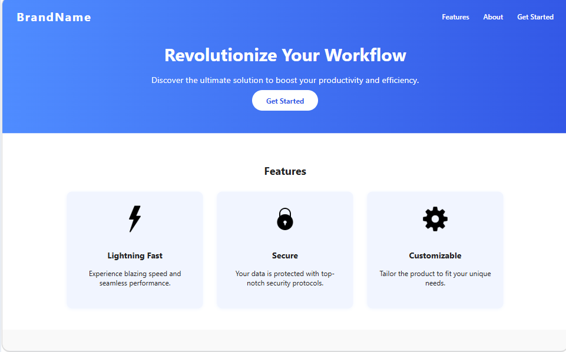

# Product Landing Page

This project is a modern, responsive Product Landing Page built with HTML, CSS, and JavaScript. It is designed to showcase a product or service, highlight its features, and encourage users to take action (such as signing up or purchasing).

## Features
- Responsive design using Flexbox
- Navigation bar with smooth scrolling
- Hero section with a call-to-action
- Features section with icons
- About section with product visuals
- Email signup form with validation
- Clean, modern UI

## Preview

## Usage
1. Clone or download this repository.
2. Open `index.html` in your web browser.
3. Customize the content, styles, and images as needed.

## File Structure
- `index.html` — Main HTML file
- `style.css` — Stylesheet for layout and design
- `script.js` — JavaScript for form validation
- `page.png` — Screenshot/preview of the landing page

## License
This project is for educational purposes. Feel free to use and modify it for your own projects.
