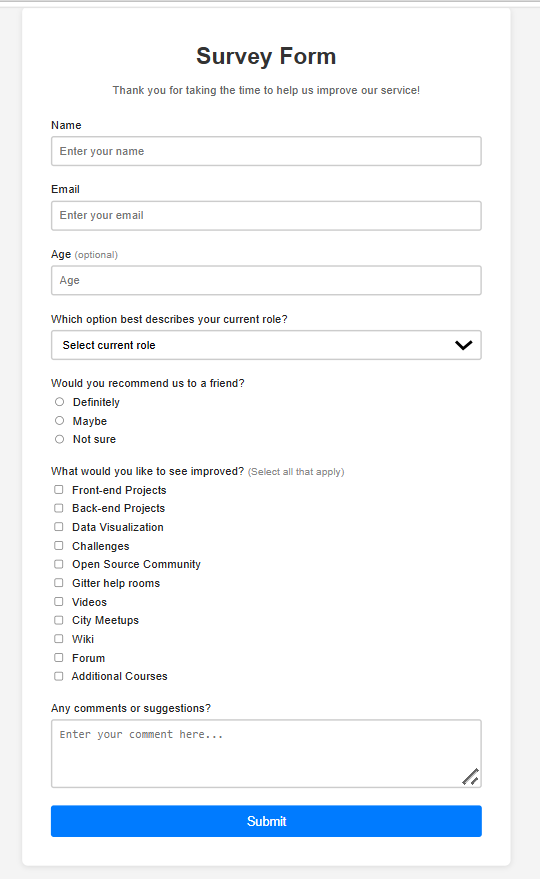

# Survey Form Project

This project is a simple and user-friendly survey form built with HTML, CSS, and JavaScript. It allows users to input their name, email, age, select their role, provide feedback, and more. The form demonstrates best practices in form design and user experience.

## Features
- Collects user information (name, email, age)
- Dropdown for role selection
- Radio buttons for recommendations
- Checkboxes for improvement suggestions
- Textarea for additional comments
- Responsive and clean design
- Form validation and submission feedback

## How to Use
1. Open `index.html` in your web browser.
2. Fill out the form fields.
3. Click the **Submit** button to send your feedback.
4. A thank you message will appear, and the form will reset.

## Files
- `index.html` — Main HTML file containing the form
- `style.css` — Styles for the form and layout
- `script.js` — Handles form submission
- `form.png` — Screenshot of the survey form

---

This project is great for learning about web forms, user input, and basic front-end development.
