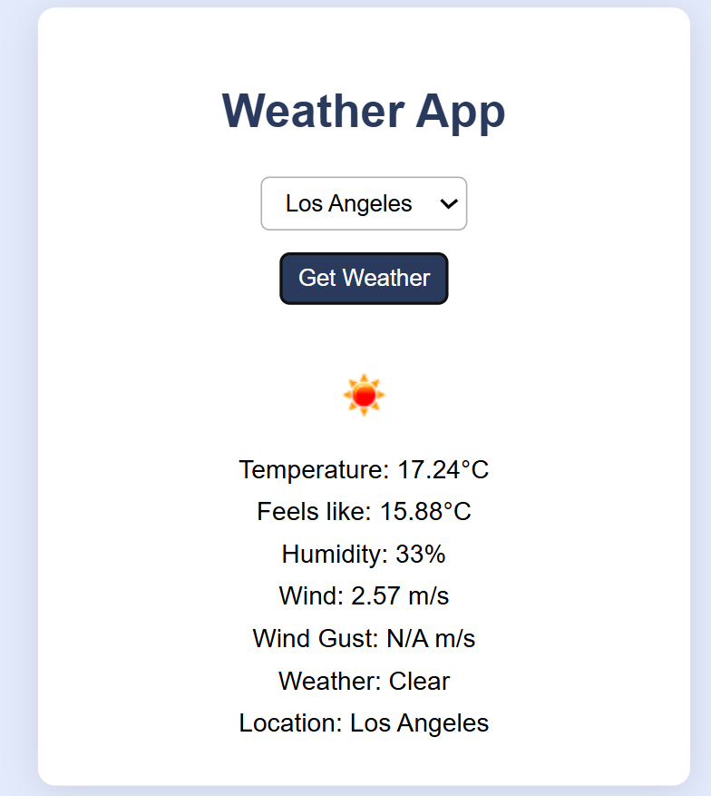

# Weather App

A simple weather app that fetches and displays weather information for selected cities using the FreeCodeCamp weather proxy API.

## Features
- Select from 6 major cities
- Fetches live weather data (temperature, humidity, wind, etc.)
- Displays weather icon and details
- Handles errors and missing data gracefully

## Usage
1. Open `index.html` in your browser.
2. Select a city and click "Get Weather".
3. View the weather information displayed below.

## License
MIT
